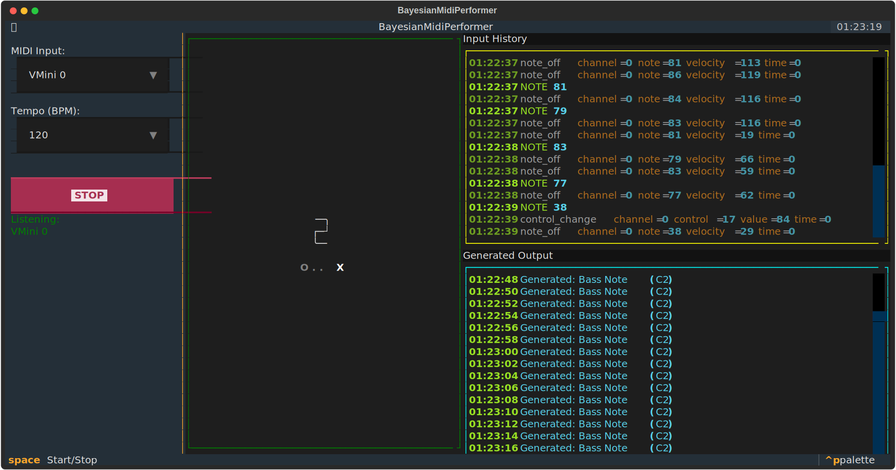

# Bayesian MIDI Performer

## Installation
1. **Create a virtual environment (recommended):**
```bash
# Windows
python -m venv venv
venv\Scripts\activate

# macOS/Linux
python3 -m venv venv
source venv/bin/activate
```

2.**Install dependencies:**
 ```bash
pip install textual mido python-rtmidi pyAgrum  
```

## Usage

```bash
python app.py
```
## Troubleshooting

### MIDI Driver Installation Issues
If `pip install python-rtmidi` fails, you likely need C++ build tools installed on your system.

* **Windows:** Install [Visual Studio Build Tools](https://visualstudio.microsoft.com/visual-cpp-build-tools/).
* **Linux (Ubuntu/Debian):** Run `sudo apt-get install libasound2-dev libjack-jackd2-dev`.
* **macOS:** You're on your own.